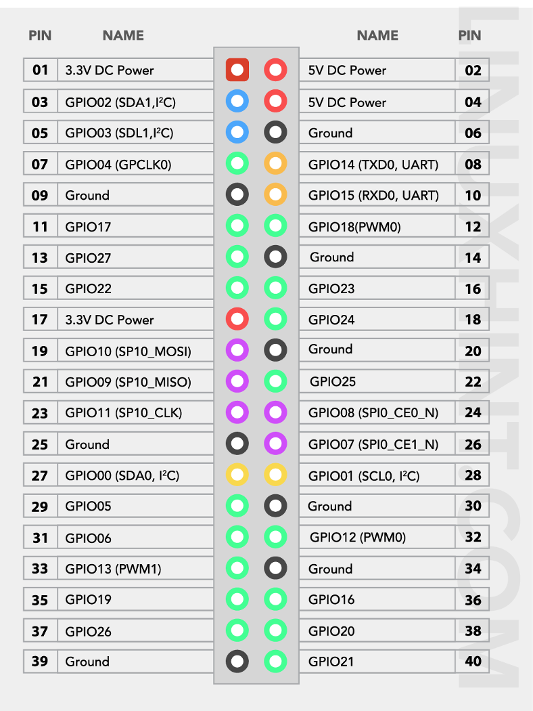

# Raspberry Pi LED agent

## Files

| File | Purpose |
| --- | --- |
| `agent_server.sh` | Launcher for the agent server: sets up the venv, stores the shared token, and starts `agent_server.py`. |
| `agent_server.py` | HTTP agent the command center calls for LED setup (color-order test and strip-length calibration); saves results to `common/settings.json`. |
| `led_controller.py` | LED strip drivers: `NeoPixelStrip` (hardware) and `SimulatedStrip`, plus the supported pixel orders. |
| `3dXmasTree.sh` | Launcher for the animation engine: sets up the venv and animation dependencies, then starts `3dXmasTree.py`. |
| `3dXmasTree.py` | Animation engine: discovers animations in `common/animations`, paces frames, and cycles them or runs them on a night schedule. |
| `night_schedule.py` | Computes sunset-to-sunrise windows (`NightSchedule`) used by the engine's `--night-schedule` mode. |

The agent controls RGB NeoPixel-compatible addressable strips. By default it runs in simulation so the command workflow can be tested before the LEDs are connected. From the repository root on the Pi, start the launcher:

```console
./pi_agent/agent_server.sh
```

The first run asks for the shared PC token and saves it under `~/.config/3dXmasTree`, outside the repository. The launcher creates/updates a virtual environment. When using a connected strip, start it with `--hardware`; the launcher installs the hardware dependencies as needed:

```console
./pi_agent/agent_server.sh --hardware
```

The agent loads GPIO pin, brightness, color order, test limit, and calibrated `led.led_count` from `common/settings.json`. Color and length setup tests use `led.test_count` (1000 by default) as their maximum address. Length setup lights one pixel; when the user presses **Done**, the Pi stores the preceding LED number as the calibrated length. Use a compatible power supply and common ground, and verify the GPIO wiring before enabling hardware mode.

The agent checks that it is running on the configured Pi hostname. Run it in an interactive SSH terminal. The command center stops it after **Yes** or **Abort**, and the Pi terminal logs the remote request and final shutdown. `Ctrl+Q` also stops it locally; `Ctrl+F4` works when the terminal forwards that key sequence.

## Animation Engine

`3dXmasTree.py` discovers concrete `Animation` subclasses recursively in `common/animations` and cycles through them. Each animation runs for 10 seconds by default at a 30 FPS target; it receives elapsed time through `doframe(dt)`. The engine owns frame pacing and strip output. Animations must not sleep in `doframe`.

General engine defaults live in `common/settings.json` under `animation`: `fps` and `seconds_per_animation`. Command-line `--fps` and `--seconds-per-animation` override them for a run.

The `3dXmasTree.sh` launcher creates or reuses `pi_agent/.venv`, scans `common/animations` for `requirements*.txt`, and installs the Pi hardware requirements only when `--hardware` is used:

```console
./pi_agent/3dXmasTree.sh
```

Useful options are `--list-animations`, `--once ANIMATION`, `--fps 60`, `--seconds-per-animation 5`, and `--hardware`. In hardware mode, calibrate and set `led.led_count` first. Without `-Hardware`, the engine uses the simulated strip and defaults to `led.capture_test_led_count`.

### Night Schedule

Continuous animation playback remains the default. Add `--night-schedule` to keep the LEDs off during the day and play random effects between adjusted sunset and sunrise. The Pi's configured local timezone is used for daylight-saving changes.

Set `night_schedule.latitude` and `night_schedule.longitude` in `common/settings.json` before enabling the schedule. `sunset_offset_minutes` and `sunrise_offset_minutes` shift those events; positive values delay them and negative values advance them. `opening_animation` and `closing_animation` are optional animation names. When set, they run once at the start and end of each night and are excluded from the random middle-of-night selection. Leave either blank to omit it.

`--once ANIMATION` plays only the named animation until `Ctrl+Q` (or `Ctrl+F4`) is pressed. It cannot be combined with `--night-schedule`.

Shared animations belong under `common/animations`. Put any third-party animation dependencies in a `requirements*.txt` file in that animation folder tree; the launcher discovers these recursively.

## Electrical considerations

Using [5V 12V 50pcs WS2811 Pixels Digital Addressable LED String Lights Waterproof RGB](https://www.ebay.co.uk/itm/286874685678?var=588901302973).

Manufacturer rates 0.3 w/LED

Using 5 strips. Adds up to 5 * 50 LEDs, and 250 * 0.3 = 75 w.

So, 75w / 5v = 15 A.

Assuming standard copper wire with a target of keeping voltage drop under 3% to 5%:

• Short runs (1 meter or less total path): At least 1.5 mm² to 2.5 mm² (approx. 16 AWG to 14 AWG) for safe current-carrying capacity (ampacity) without dangerous heating.

• Medium runs (2 meters total path): At least 2.5 mm² to 4 mm² (approx. 14 AWG to 12 AWG). A 1.5 mm² wire over a 2m run at 15A drops about 0.72V (~14.4% drop), which can cause dimming or device malfunction.

• Longer runs (3 to 5+ meters): Up to 6 mm² to 10 mm² (approx. 10 AWG to 6 AWG) or you must step up the voltage (e.g., use 24V or 48V with a buck converter near the load) to prevent excessive power loss and voltage drop.


Key Considerations for 5V at 15A

• Total Length is Round-Trip: Remember to calculate the length for both the positive and negative conductors combined (e.g., 2 meters out and 2 meters back = 4 meters of total wire resistance).

• Ampacity vs. Voltage Drop: While a thin wire (like 1.5 mm²) might technically handle 15A briefly in open air without melting, the 5V supply means you cannot afford high resistance.

• Connectors Matter: Standard USB or small jumper connectors will fail or melt at 15A; you need heavy-duty terminals (like XT60, Anderson Powerpoles, or bolted terminal blocks).

### Pinout



### Raspberry Pi 4 Power Pins (3.3 V, 5 V, GND)

#### 5 V Pins (direct from USB‑C power input)

These are unregulated 5 V straight from the Pi’s power supply.

• Pin 2 — 5 V

• Pin 4 — 5 V

Use these for powering Neopixels (they need 5 V).

#### 3.3 V Pins (regulated)

These are safe for sensors, logic, and low‑power modules.

• Pin 1 — 3.3 V

• Pin 17 — 3.3 V

Do NOT power Neopixels from 3.3 V.

#### Ground Pins (GND)

You can use any of these:

• Pin 6 — GND

• Pin 9 — GND

• Pin 14 — GND

• Pin 20 — GND

• Pin 25 — GND

• Pin 30 — GND

• Pin 34 — GND

• Pin 39 — GND

For Neopixels, choose a GND close to Pin 12 (GPIO18) to reduce noise.

#### Recommended wiring for Neopixels on Pi 4

##### Signal

PIO18 (Pin 12) → Neopixel DIN

##### Power

• Pin 4 (5 V) → Neopixel 5 V

• Pin 6 (GND) → Neopixel GND

• Pi GND must be shared with Neopixel GND

##### Optional but strongly recommended

• Level shifter (3.3 V → 5 V)

• 1000 µF capacitor across 5 V and GND

• 330–470 Ω resistor in series with the data line